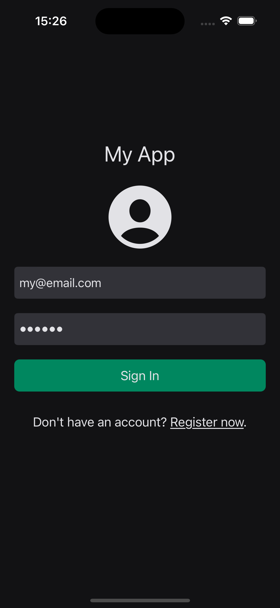

<h1 align="center">Login App</h1>

 

## :dart: About

This project consists of two screens - a login screen and a sign-up screen, built using UIKit and following the ViewCode approach.

## Screenshots

{width=100 height=100}
{width=100 height=100}

## :rocket: Technologies

The following tools were used in this project:

- [Swift](https://developer.apple.com/swift/)
- [UIKit](https://developer.apple.com/documentation/uikit)

<a href="#top">Back to top</a>
